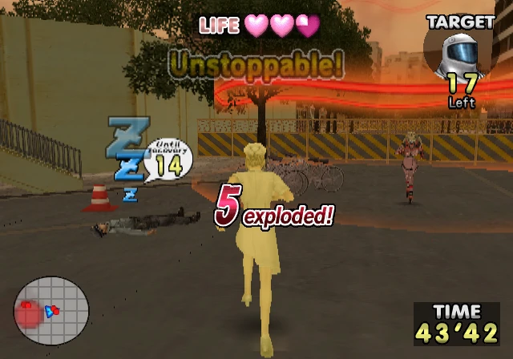
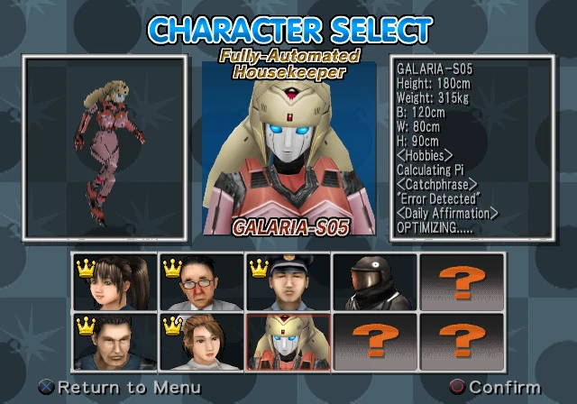
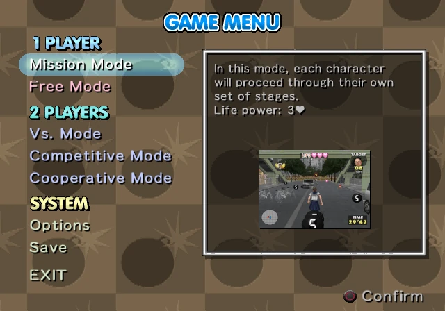

# Simple-2000-Series-Ultimate-Vol.-17-Taisen-Bakudan-Poi-Poi-English-Translation-Patch
An English translation patch for "Simple 2000 Series Ultimate Vol. 17: Taisen! Bakudan Poi Poi " [SLPM-62468] PS2 game developed by IMJ Entertainment/FLAT-OUT and published by D3Publisher.

**Patch is in xdelta format and was tested with MD5: 8f300ca07eebdc9dc3b4e0be2c2eb503 copy of the game.**

All in-game text and UI/Menus were translated from Japanese to English.

## Tools used:
* [PCSX2](https://pcsx2.net/) - Debugging.
* [MKPSXISO](https://github.com/Lameguy64/mkpsxiso) - Extraction and rebuilding of BIN image.
* [Delta Patcher](https://github.com/marco-calautti/DeltaPatcher) - Creation of patch file.

## Credits:
* **ScatterBrain** - Hacking, graphics
* **Cash Ogawa** - Translation

## Screenshots

